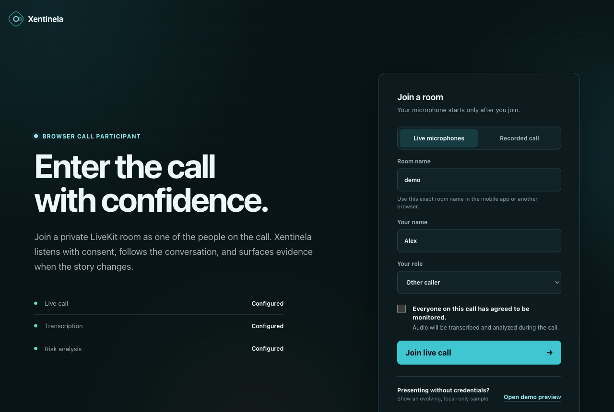
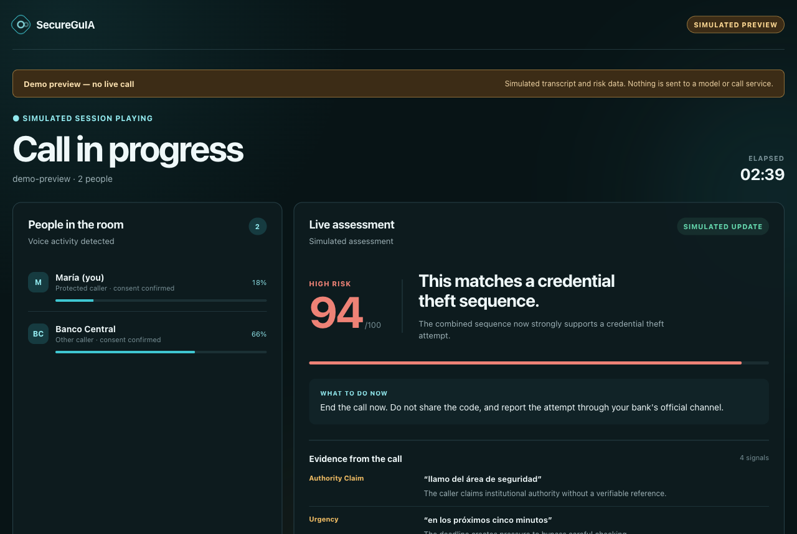
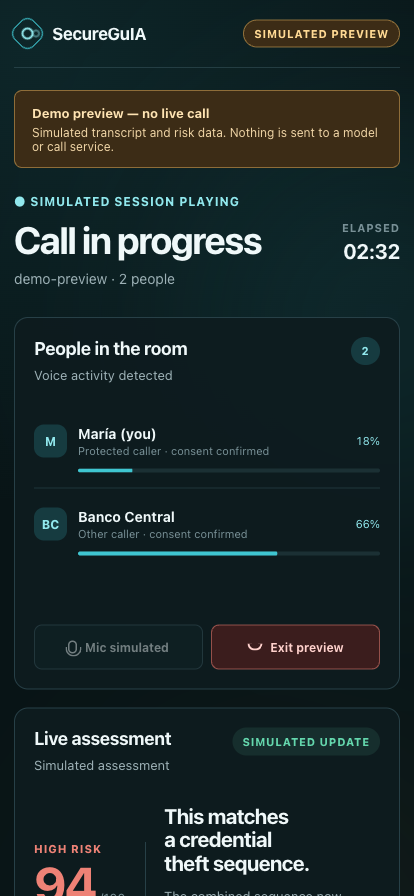
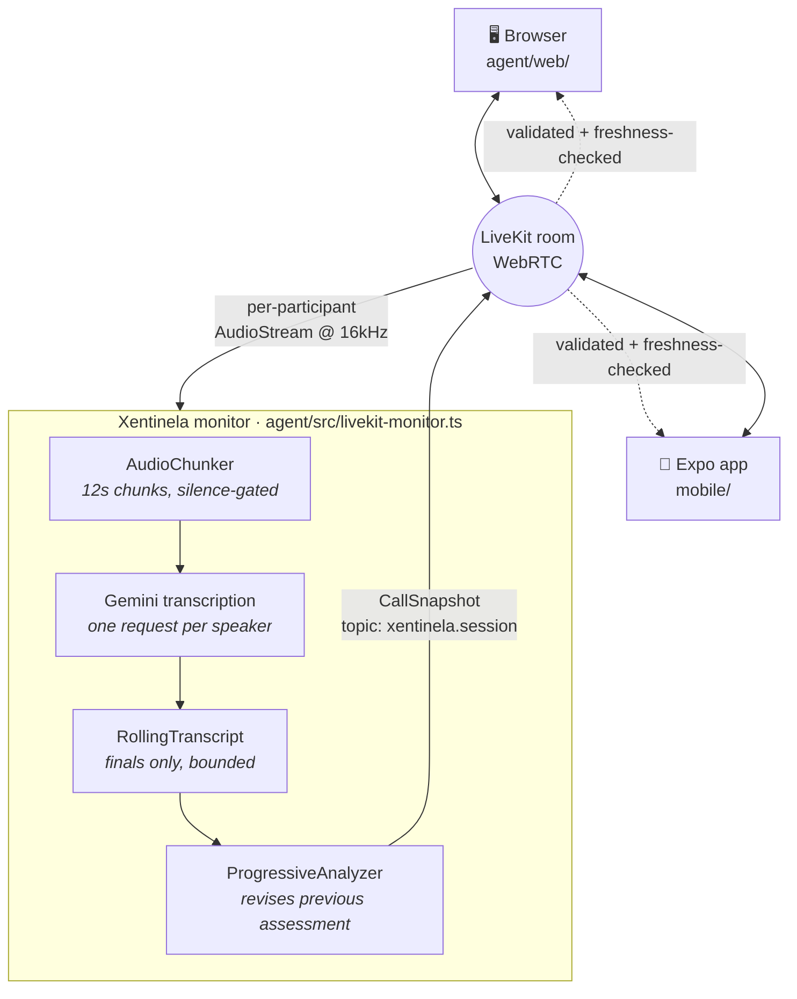
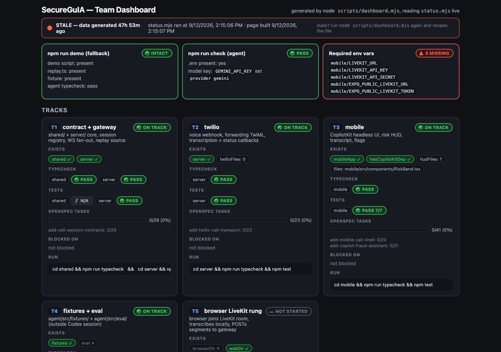

# hackathon-agents-tinkers

Workspace for [**Agents, Everywhere**](https://bogota.aitinkerers.org/hackathons/h_q4-sNJw_JYI),
the AI Tinkerers global hackathon — Bogotá chapter, 12–13 September 2026.

Several projects sharing one theme: putting an agent where the conversation already is — in a
browser, in Slack, on a phone, inside a live call. The main build is **Xentinela**, a live call
guard; the rest are the experiments and infrastructure it grew out of.

---

## What is in this repo

Each folder is self-contained. `cd` into it and read its own README.

| Folder | What it is | Status |
|---|---|---|
| [`meet-mobile-tap/`](./meet-mobile-tap) | **Xentinela** — the main build. Gateway, call monitor, browser client and Expo app | Working |
| [`xentinela/`](./xentinela) | The Xentinela app shell — client UI wired to the detection gateway | Working, partial |
| [`agents-everywhere-starter-kit/`](./agents-everywhere-starter-kit) | The official hackathon starter kit (CopilotKit, MIT) plus local work on a `/voice` surface | Reference |
| [`two-way-demo/`](./two-way-demo) | A two-way agent ↔ UI loop on CopilotKit v2 — the agent renders components, the UI reports back | Working |
| [`claude-agent-server/`](./claude-agent-server) | An AG-UI bridge exposing the Claude Agent SDK so CopilotKit can drive it | Working |
| [`docs/`](./docs) | The phased scam-protection specification — written before implementation | Spec only |

### A naming wrinkle, so it does not confuse you

**`meet-mobile-tap/` is where Xentinela lives.** The folder is named after the original question —
*can a React Native app tap the audio of a Google Meet or Zoom call?* The answer turned out to be
a firm no at the OS level, the project pivoted to being a participant in the call rather than an
eavesdropper on one, and the folder name stayed. [`meet-mobile-tap/CLAUDE.md`](./meet-mobile-tap/CLAUDE.md)
is the research trail for that dead end and is worth reading before anyone tries it again.

### The two Xentinela folders

- `meet-mobile-tap/` is the **system**: the gateway, the server-side call monitor, the browser
  participant, the Expo participant, and the shared snapshot contract between them.
- `xentinela/` is a **standalone app shell** — the client UI for the same gateway, with tabs for
  seeded calls alongside the live one. Telephony and guardian messaging are not connected there.

### Supporting work

**`agents-everywhere-starter-kit/`** — cloned from
[CopilotKit/agents-everywhere-starter-kit](https://github.com/CopilotKit/agents-everywhere-starter-kit)
(MIT, `LICENSE` retained) at `a997712`. Local additions on top of upstream:
`apps/web/src/lib/stereo-capture.ts`, a tab+mic stereo tap that merges two sources into the left
and right channels of one stream so speaker separation costs nothing; and
`apps/web/src/lib/transcription-session.ts`, a listening OpenAI Realtime session that transcribes
without ever answering back.

**`two-way-demo/`** — a sprint board with two drivers: a human who drags cards, and an agent that
can see the board, change it, draw it, and ask permission. Every crossing of the agent/UI boundary
is logged on screen so you can watch the loop instead of inferring it.

**`claude-agent-server/`** — uses your local Claude Code login when no API key is set.

Requires Node >= 22.

---

# Xentinela

**A live call guard.** Two people are on a call. One of them is being socially engineered.
Xentinela listens with consent, follows the conversation as it develops, and tells the person
being targeted what is happening — while they are still on the line.



## The problem

Scam calls do not announce themselves. They *develop*. A bank-impersonation call opens politely,
establishes authority, invents a frightening transaction, manufactures urgency, isolates you from
anyone who might talk you out of it — and only then asks for the one-time code. Each step is
individually plausible. The shape is only obvious in hindsight.

A summary after the call is useless. The money is gone.

So Xentinela re-reads the whole transcript every few seconds and revises its assessment as the
pretext builds. The score climbs with the call.

> ```
> authority claim  →  urgency  →  isolation  →  the OTP ask
>    ELEVATED 60   →     ↓      →      ↓      →    HIGH 95
> ```



Evidence is quoted verbatim from the transcript, in the language spoken. A finding you cannot
check against the words said is not a finding.

## See it in 30 seconds

No credentials, no microphone, no model calls, no phone:

```bash
cd meet-mobile-tap
npm run setup:gateway
npm run dev
```

Open <http://localhost:8787> → **Open demo preview**. It drops you two minutes into an evolving
call.

The persistent amber **Demo preview — no live call** banner is deliberate: simulated data must
never be able to pass for a real model result. Every screenshot here is that preview, captured
from the running app.

## On the phone

The same call, same assessment, on the device of the person being protected.



React Native via Expo, with a native development build — LiveKit needs real WebRTC, so Expo Go
cannot run it.

## How it works

Everyone — both humans and the monitor — is a participant in one LiveKit room. The monitor is
simply a server-side participant that never speaks.



**Why a room participant and not a phone tap.** The one rule this whole project reduces to:

> React Native can capture any call your app is a party to. It can never capture a call another
> app owns.

Tapping Zoom, Meet, or the native dialer from a third-party app is blocked at the OS level on both
platforms — Android's `AudioPlaybackCapture` refuses `USAGE_VOICE_COMMUNICATION`, and iOS blocks
cross-app VoIP audio in the routing layer. Worse, Android's concurrent-capture policy does not
*fail* when you try; it hands you silence, so the recorder reports success and returns zeros.
Being a participant sidesteps all of it.

**Speaker labels are free.** Each participant is a separate audio track, so the transcript knows
who spoke without any diarization.

### The snapshot contract

One validated shape, [`shared/session.ts`](./meet-mobile-tap/shared/session.ts), rendered by both
clients. The monitor publishes; the clients only ever read. Receipt rules live in
[`shared/room-session.ts`](./meet-mobile-tap/shared/room-session.ts) and are shared so the browser
and the phone cannot drift:

- the publisher identity must be the monitor — any participant can send data on a room
- room and sequence number must match, so a stale or replayed packet is dropped
- **older than 15s is stale**, and a stale snapshot *removes* the score and the guidance

That last rule matters more than it looks. A risk score frozen on screen while the pipeline is
dead is worse than no score, because the person trusts it. Degraded states say so.

## Three ways to put a call in front of the model

Each rung is a complete demo. Rehearse from the bottom up.

| Rung | What the call is | Needs | Status |
|---|---|---|---|
| **`replay`** | Scripted call through the real pipeline | One model key | **Works** — `cd meet-mobile-tap/agent && npm run demo` |
| **`livekit`** | Two WebRTC clients in a room — a real call | LiveKit + Gemini | **Works** — browser ↔ phone |
| **`twilio`** | Real PSTN | A number, regulatory setup | Not built |

`replay` exists because a demo that depends on a network, a device, and two model providers will
fail on stage eventually. It runs the genuine `RollingTranscript` and `ProgressiveAnalyzer`
against [`agent/src/fixtures/bank-scam.ts`](./meet-mobile-tap/agent/src/fixtures/bank-scam.ts), a
Colombian bank-impersonation pretext in Spanish. Only the audio is fake.

## Decisions that took the longest to get right

Most of these are one line of code and a day of finding out.

**Analyse progressively, not repeatedly.** "Concatenate every few seconds and send it" is the
right instinct and breaks three ways on a real call, so
[`analyzer.ts`](./meet-mobile-tap/agent/src/analyzer.ts) skips a pass when no new speech arrived;
*drops* a tick that lands while a pass is still running rather than queueing it, because a queue
on a fixed interval only ever grows; and bounds the prompt by keeping the head **and** tail of the
transcript — unbounded concatenation is fine for ten minutes and fatal for an hour. The opening
pretext matters as much as the last sentence.

**Carry the previous assessment into the next prompt.** This is what makes it *progressive* rather
than recomputed. The model revises, and reports what `changed`.

**Only finalised turns reach the transcript.** Streaming deltas get revised constantly, and
analysing revised text makes the model argue with itself between passes.

**Gate on silence before spending an API call.** Not an optimisation — a correctness fix.
Transcription models hallucinate confident sentences from room tone; feed one twelve seconds of
silence and it returns something plausible, which lands in the transcript as a turn nobody said
and then gets reasoned about as evidence.
[`audio-chunker.ts`](./meet-mobile-tap/agent/src/audio-chunker.ts) measures voiced milliseconds
and drops the chunk. The transcription prompt is a second line of defence.

**Never show a reassuring zero.** Missing analysis stays pending with an em dash. A zero looks
like "checked, you're fine."

**The free tier shapes the architecture.** Gemini's free tier is single-digit requests per minute,
which is low enough that the analysis interval is a per-provider value rather than a constant. Two
speakers on 12s chunks is already 10 rpm before the analyzer asks for anything — which is the
other reason silence-gating earns its place.

## What this deliberately does not do

Stated plainly, because a demo that overstates itself is worse than a smaller honest one:

- No Twilio/PSTN. No capture of calls owned by another app — see above; it is not possible.
- No persisted transcripts. The phone's end screen reflects the last snapshot it received.
- The gateway is a **trusted-local-network demo**. No application login. Do not expose it as a
  public token service.
- The OpenSpec event log in [`openspec/`](./meet-mobile-tap/openspec) is a proposed contract, not
  yet reconciled with the shipped implementation.
- Health checks say "Configured", never "Ready" — they verify that keys exist, not that any
  provider will answer.

## Running a real call

Copy `meet-mobile-tap/agent/.env.example` to `agent/.env`:

| Setting | Where | Purpose |
|---|---|---|
| `LIVEKIT_URL` | [LiveKit Cloud](https://cloud.livekit.io) → project settings | Room server (`wss://…`) |
| `LIVEKIT_API_KEY` | Project → Settings → API keys | Server auth |
| `LIVEKIT_API_SECRET` | Same entry | Signs short-lived room tokens |
| `GEMINI_API_KEY` | [Google AI Studio](https://aistudio.google.com/apikey) | Transcription + default analysis |
| `OPENAI_API_KEY` | Optional | Alternative analysis; Gemini still does transcription |

Then:

1. Browser companion on the computer at <http://localhost:8787>. Pick a room, name, role, confirm
   consent, join.
2. On the phone: **LiveKit**, the gateway's printed LAN URL, the same room name, consent.
3. **Use headphones.** Check both people hear each other and the meters move.
4. Speak for at least 12 seconds — transcription works in 12s chunks, so this is not word-by-word
   captioning.

Browsers require localhost or HTTPS for microphone access. Each join gets a 30-minute room-scoped
token; provider secrets never enter the app bundle. Credentials live in ignored `agent/.env` and
are never committed.

Full phone-build and local-LiveKit instructions are in
[`meet-mobile-tap/README.md`](./meet-mobile-tap/README.md).

## Verification

```bash
cd meet-mobile-tap
npm test                          # 141 tests across agent, server, mobile
cd agent && npm run typecheck && npm run build:web
cd agent && npm run smoke:local   # two real RTC clients, synthetic audio, no models
```

The local smoke test joins two real RTC clients through the gateway and verifies two-way audible
PCM and receipt of the same monitor session by the shared snapshot receiver. It does **not** test
physical microphones, Cloud networking, or model responses.

---

## How it was built

Two days, three people, and a lot of agent-written code — where the interesting problem turned out
to be coordination rather than typing.



*The internal build dashboard — generated from a live status script, not hand-maintained. Tracks,
what exists, what typechecks, what is blocked. The shot above is deliberately unretouched: it
shows the board stale and five env vars missing, which is what these things actually look like
mid-hackathon. It predates the rename from SecureGuIA.*

- **One track owns a directory; nobody else writes there.** With several agents working in
  parallel, two of them editing one file is how the file and the afternoon get lost.
  [`TRACKS.md`](./meet-mobile-tap/TRACKS.md) carries the rule and the boundaries.
- **Contracts cross boundaries, not edits.** A shape change goes into `shared/`, and
  `tsc --noEmit` in every consumer names who else it touches.
- **Prose goes stale the moment someone lands a commit.** Every doc here says so, and says to
  verify against the repo.
- **The dead ends are documented as carefully as the working paths.**
  [`meet-mobile-tap/CLAUDE.md`](./meet-mobile-tap/CLAUDE.md) records which capture routes are
  blocked at the OS level and why, so the next person does not spend an afternoon rediscovering
  that Android returns silence rather than an error.

Built by [@cdcordobaa](https://github.com/cdcordobaa), toby arc, and Andres Celis.

## A note on secrets

No real credentials are committed. `.env.example` files are templates with placeholder values;
real keys live in gitignored `.env` / `.env.local`.

---

<sub>Consent is a build requirement here, not a footnote: every join is gated on it, and the
monitor never opens a microphone the user has not agreed to. Recording laws vary — several
jurisdictions require all-party consent.</sub>
