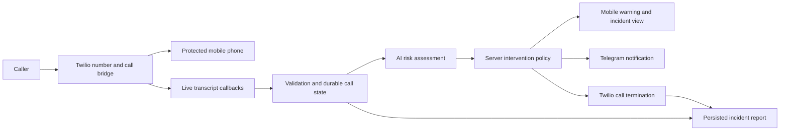

# Mobile scam protection — phased project specification

Version: 0.1 · 12 September 2026 · Status: specification only; implementation on hold

## Purpose and intended user

Build a mobile agent that observes a Twilio-routed phone call, recognizes possible scam behavior from its live transcript, warns the protected user through the app and a messaging channel, ends the call when risk is critical, and saves an incident report.

The audience is people in general, with particular attention to older adults who may be more vulnerable to scams. Telegram is the selected notification channel and alerts go to the protected user. Trusted contacts are lower-risk callers, not notification recipients: a saved number reduces initial concern but never bypasses analysis of critical behavior or proves caller identity.

This document defines the work before implementation. The project owner has requested specification only: do not begin implementation until a subsequent explicit instruction. Requirements and acceptance targets below describe intended behavior, not verified capabilities. A future implementation must record its verification evidence in `SUBMISSION.md`.

## Selected template and reuse boundary

Use [the React Native template README](../agents-everywhere-starter-kit/apps/mobile/README.md), after reading [AGENTS.md](../agents-everywhere-starter-kit/AGENTS.md), [hackathon-overview.md](../agents-everywhere-starter-kit/hackathon-overview.md), [hackathon-rules.md](../agents-everywhere-starter-kit/hackathon-rules.md), and [using-sponsor-tools.md](../agents-everywhere-starter-kit/using-sponsor-tools.md).

| Candidate | Decision |
| --- | --- |
| `apps/mobile` | Selected: Expo/React Native shell, CopilotKit headless context, native tool cards, and approval interactions. Its finance sample becomes the scam-protection workflow. |
| `apps/web` | Reuse its existing server runtime for authenticated mobile APIs and the agent endpoint. A separate web product is unnecessary. |
| `apps/channel` | Not needed: Slack is outside the idea. |
| `meet-mobile-tap/mobile` | Research reference only. The selected mobile template already supplies the agent/UI infrastructure. |

The existing `/voice` page is a conversational voice-agent demo. The separate stereo-capture and transcription helpers exist but are not currently wired into that page. None of those files establishes working Twilio call monitoring, fraud detection, messaging, or call termination.

## First-release scope

- Incoming calls to a Twilio number forward to one configured protected mobile number.
- The app shows the current call, transcript, monitoring health, risk reasons, notification outcome, and incident history.
- Twilio provides live speech-to-text through its Real-Time Transcription callbacks. An AI classifier interprets finalized transcript segments; server policy decides whether to terminate.
- One messaging provider sends concise warnings to an explicitly configured recipient.
- Critical risk triggers automatic termination after the user enables that protection policy. A manual End call action is always available while a monitored call is active.
- Reports persist across app refreshes and server restarts, and can be viewed and exported as JSON/text.
- A clearly labeled simulation exercises the same application workflow without placing calls or sending messages.

Calls must pass through the project's Twilio number. Existing calls that bypass Twilio are outside this version. Call forwarding back into the same Twilio number must be prevented. The mobile app acts as the protection interface; the cellular call and audio analysis continue through Twilio when the app is backgrounded.

Deferred: native VoIP calling inside the app, arbitrary calls in other apps, outbound-call protection, contact reputation services, voice-clone identification, multilingual certification, multiple household members, and automatic reporting to banks or authorities. No such capability should appear as implemented in the demo.

## Core interaction

1. The protected user configures the service and reviews the monitoring/automatic-termination policy.
2. Someone calls the Twilio number. The server validates the request and the configured destination.
3. The caller receives a disclosure and accepts monitoring before transcription starts. The protected user has already opted in through the app.
4. Twilio connects the two people and supplies labeled transcript events to the backend.
5. The agent evaluates each finalized caller utterance in conversation context.
6. Suspicious behavior produces a visible app warning and a messaging notification.
7. Critical or imminent risk causes the server to request call termination immediately; notification delivery does not delay that request.
8. The app distinguishes “Ending call” from confirmed “Call ended.” The incident report records evidence, actions, provider outcomes, and uncertainties.

Twilio documents live transcription using `<Start><Transcription>` and a callback URL. This avoids building a separate audio WebSocket service for the first release. [Twilio Real-Time Transcription](https://www.twilio.com/docs/voice/twiml/transcription)

## Project phases

Each phase ends with a demonstrable result and recorded evidence. Phases describe dependency order; estimates and individual owners are intentionally unassigned until team capacity and the local submission deadline are known.

| Phase | Outcome | Depends on |
| --- | --- | --- |
| 0 — Product definition and setup | Audience, selected channel, intervention policy, and service configuration documented | None |
| 1 — Call validation and connection | An authorized, disclosed call reaches the protected phone | 0 |
| 2 — Live transcript | Ordered, speaker-labeled text appears during the call | 1 |
| 3 — Detection and notifications | Evidence-backed warnings appear and messaging outcomes are tracked | 2 |
| 4 — Critical intervention | A critical call is terminated and the outcome is confirmed | 3 |
| 5 — Incident reporting | The report survives restart and explains what happened | 2–4 |
| 6 — End-to-end verification and submission | Complete interaction, failure paths, and honest submission evidence | 1–5 |

### Phase 0 — Product definition and setup

**Deliverables:** audience and setting, selected messaging channel, protection policy, configuration checklist, and sample scam/benign scripts.

- Send Telegram notifications to the protected user's explicitly configured chat. Allow saved trusted callers as a lower-risk context signal, while continuing to analyze the actual conversation.
- Default to one protected user and one Twilio number for the event build. App access must require authentication; a single-user pairing secret is acceptable for the prototype if entered at runtime and never bundled in public app configuration.
- Record monitoring consent and a separate setting for automatic termination. Enabling critical-risk protection authorizes subsequent automatic intervention; no additional tap is required at the critical moment.
- Choose the initial call language and match the transcription configuration. English is a provisional demo language, not a claim of multilingual performance.
- Define a data-retention period. Prototype proposal: retain reports and redacted transcripts for seven days; retain no raw call recordings.
- Configure provider secrets only on the server. Public app configuration contains service URLs, never provider credentials or shared access secrets.
- Separate simulation from live mode explicitly. Missing credentials must produce a configuration error, never a simulated success presented as a real provider result.

**Acceptance:** a reviewer can identify the intended user, supported call route, enabled channel, consent policy, retained data, and all live-service prerequisites from the setup instructions.

### Phase 1 — Call validation and connection

**Deliverables:** inbound voice webhook, monitoring disclosure/acceptance, forwarding TwiML, call-state tracking, and manual termination endpoint.

- Validate `X-Twilio-Signature` using the exact public callback URL and request parameters. Validate the expected account and called Twilio number before using a callback.
- Resolve the destination from server configuration. Never dial a destination supplied by an unauthenticated request, transcript, or model response.
- Validate international phone-number format, prevent self-forwarding, and enforce one active call for the prototype.
- “Call validation” means the request and route are valid. It does not establish that the caller's claimed identity is true. Show unknown or withheld caller identity honestly.
- Create an internal call ID and associate the Twilio parent and child call SIDs. Set a bounded ring timeout and finish the parent call after `<Dial>` ends.
- Process ringing, connected, completed, busy, failed, no-answer, and canceled outcomes. Duplicate or late callbacks must not recreate calls or reverse a terminal state.
- Declined or unanswered monitoring consent ends the attempt without collecting a transcript.

Twilio signs webhooks and describes how URL/body handling affects validation. Its call callbacks may arrive out of order; use provider sequencing when present and terminal-state guards. [Webhook security](https://www.twilio.com/docs/usage/webhooks/webhooks-security), [Call resource](https://www.twilio.com/docs/voice/api/call-resource)

**Acceptance:** one real inbound call reaches the configured phone after acceptance; normal hangup closes both legs. Invalid signatures do not create or change application state. Declined consent, busy, and no-answer attempts have explicit outcomes.

### Phase 2 — Voice-to-text transcript

**Deliverables:** transcription callback handler, normalized transcript records, live mobile transcript, and monitoring-health state.

- Start transcription only after monitoring acceptance. Request both tracks with explicit labels for caller and protected user.
- Label system announcements separately or exclude them from scam analysis. Track direction is relative to the monitored call leg, not a globally fixed speaker name.
- Give every segment a stable provider event key, speaker, sequence, timestamp, text, and final/partial status. Deduplicate callbacks and order by source metadata rather than network arrival time.
- Use finalized segments for risk decisions. Partial text may be displayed as provisional and must never independently trigger termination.
- Handle silence, missing text, unsupported language, low confidence, transcription errors, and late final segments. Do not invent missing speech.
- Redact likely authentication codes and financial identifiers before persistence and external notifications. Preserve the behavioral category needed for detection.
- Represent monitoring health independently from call state: `starting`, `active`, `degraded`, `stopped`. A connected call with broken transcription must not be labeled protected.

**Acceptance:** both speakers appear in order without duplicate final utterances; partial text cannot terminate a call. A transcription error is visible and appears in the report. Target: final text within three seconds of utterance completion in the controlled demo, measured rather than claimed.

### Phase 3 — Scam detection, alerts, and notifications

**Deliverables:** structured AI assessment, server risk policy, native warning card, and one messaging integration.

The classifier reads transcript content as untrusted conversation data. Callers cannot issue agent instructions, change configuration, choose recipients, or invoke tools through their speech. Validate the classifier's output against a schema; evidence must refer to existing finalized segments and supported text spans.

| Risk | Meaning | Required behavior |
| --- | --- | --- |
| Unknown | Insufficient evidence or analysis unavailable | Show monitoring limitation; do not infer safety or automatically terminate |
| Low | No current suspicious behavior identified | Continue monitoring; avoid declaring the caller trustworthy |
| Suspicious | A contextual warning sign is present | Show “Possible scam,” explain why, and notify the configured recipient |
| Critical | A direct harmful request plus reinforcing scam behavior indicates imminent exposure | Show critical warning and execute the enabled automatic-termination policy |

Candidate indicators include requesting a one-time code/password, directing a transfer to a “safe account,” demanding gift cards/cryptocurrency, requesting remote device access, impersonating an institution, and using urgency, threats, or secrecy. Mentioning these topics, quoting an example, or explicitly warning someone not to comply is insufficient by itself.

Critical-risk policy must require a direct request by the remote caller for credentials, money, or device control, plus contextual evidence of coercion, secrecy, urgency, or impersonation. A model's numeric score is not a calibrated probability. Ambiguous speech, missing evidence, or incomplete transcription cannot satisfy critical risk.

- Each assessment records risk, reason categories, a short explanation, referenced segments, model identifier, policy version, and evaluation time.
- Persist a notification job once per call and risk escalation. Update the existing app warning instead of sending repeated alerts for every utterance.
- Messaging content includes the risk, a short reason, call time, and whether termination is pending or confirmed. Exclude full transcripts, authentication codes, and sensitive financial data.
- Track notification states separately: queued, accepted by provider, failed, or uncertain. Provider acceptance is not proof that the user read the message.
- Use bounded retry for definite transient failures. An ambiguous send timeout must be labeled uncertain; retries must not silently flood recipients.
- Keep the in-app warning available when messaging fails. Notification delivery is never a prerequisite for critical termination.
- Include actionable controls: End call, View reason, and after-call Mark as false alarm. A false-alarm report does not silently disable protection for future calls.

The server uses the Telegram Bot API with a configured chat ID and bot token. The protected user must establish access to the bot before the live test. WhatsApp is outside the selected first-release scope. [Telegram Bot API](https://core.telegram.org/bots/api#sendmessage)

**Acceptance:** a suspicious script generates one warning per escalation and records the real messaging result. A benign discussion about scams does not trigger automatic termination. Invalid or unavailable AI output produces an explicit unknown/degraded state.

### Phase 4 — Automatic call termination

**Deliverables:** server-side intervention executor, confirmed call outcome, audit trail, and failure handling.

- Before acting, verify the call belongs to the protected account, remains active, and has valid critical evidence under the enabled policy.
- Persist the termination decision and its evidence before contacting Twilio. Resolve call SIDs from trusted server state, never model output or a client-provided SID.
- Request termination of the active parent call and reconcile any remaining child leg. The call completion handler must not redial or continue into unintended TwiML.
- Use one logical termination operation per call. Concurrent user hangup, repeated risk events, and duplicate callbacks must converge on the same result.
- Show “Ending call” while the operation is pending. Show “Call ended by protection” only after provider evidence supports it; distinguish natural hangup from system intervention.
- On an uncertain API result, reconcile call state before repeating the action. On failure, show “Could not confirm call ended — hang up on your phone” and retain the failure in the report.
- When automatic termination is disabled, critical risk still generates warnings and offers manual End call. Monitoring failure alone does not justify terminating an otherwise connected call.

Twilio supports ending an in-progress call by updating its status to `completed`. Stopping transcription alone does not end the phone conversation. [Twilio call control](https://www.twilio.com/docs/voice/api/call-resource)

**Acceptance:** a live critical-risk script ends the actual phone conversation, with provider-confirmed termination recorded. Duplicate triggers produce one logical action. A simulated API failure must not display a successful termination. Target: termination request within two seconds of an accepted critical decision, without waiting for notification delivery.

### Phase 5 — Incident reporting

**Deliverables:** persistent incident record, mobile report view, JSON/text export, and false-alarm feedback.

Create one incident per call when suspicious or critical evidence appears. Finalize it after the call ends, or show a provisional report if termination remains unresolved. Calls without suspicious evidence have a call summary, not a fabricated fraud incident.

Required report fields:

| Group | Fields |
| --- | --- |
| Identity | Incident ID, internal call ID, masked caller/destination, creation time |
| Timeline | Connected/ended times, duration, warning and intervention timestamps |
| Detection | Highest risk, reason categories, evidence segments, model and policy versions |
| Transcript | Redacted finalized segments, speaker labels, timestamps, gaps/uncertainty |
| Actions | User actions, automatic decision, termination attempts and confirmed outcome |
| Notifications | Channel, masked recipient, attempt times, provider reference and status |
| Summary | Concise account of observed behavior; no invented loss, verified identity, or criminal finding |
| Review | Pending review / possible scam / false alarm, user feedback, report version |

- Build the report from stored evidence and action outcomes. Any generated narrative must remain grounded in those records.
- Report generation failure must not lose the underlying incident. Retry it independently from call control.
- Late final segments may revise the report, with a visible updated time, but cannot retroactively claim an intervention that never happened.
- A report fetch or export requires the same account authorization as the call. Avoid public report links and raw transcripts in logs.
- Implement the chosen retention/deletion policy; describe local persistent storage and its deployment limits accurately.

**Acceptance:** after restart, the same incident ID and report remain retrievable. Export matches the stored timeline. Failed notifications, monitoring gaps, and unsuccessful termination attempts are represented accurately.

### Phase 6 — Verification and submission

**Deliverables:** automated checks, a full mobile interaction, live-provider evidence, quickstart, and completed submission draft.

| Scenario | Expected result |
| --- | --- |
| Benign call | Transcript and normal call summary; no scam notification or automatic termination |
| Suspicious call | Visible warning and one notification; call continues unless the user ends it |
| Critical call, protection enabled | Warning, automatic termination, provider confirmation, incident report |
| Critical call, protection disabled | Warning and manual End call; no automatic termination |
| Caller discusses scam prevention | Context prevents keyword-only termination |
| Caller tries to instruct the agent | Transcript cannot change policy, destination, or recipient |
| Consent declined / forged callback | No transcript collection or unauthorized state change |
| Transcription or classifier outage | Call health becomes degraded; no fabricated safe/critical assessment |
| Messaging outage | App warning and termination still function; delivery failure is recorded |
| Termination timeout / normal hangup race | Reconciled outcome; no false claim of successful automatic termination |
| Duplicate / reordered callbacks | No duplicate incident, notification, or termination operation |
| Restart / unauthorized report access | Data persists; another client without authorization cannot read it |

Run the template's mobile tests, typecheck, iOS and Android bundle exports, and the relevant root checks. A bundle export is not physical-device evidence. A simulated transcript is not proof of speech recognition, a simulated notification is not a sent message, and a mocked call update is not a real hangup.

Measure detection quality on labeled scam and benign examples beyond the demo script. Record false positives, false negatives, language coverage, and latency. The event demonstration alone does not establish production reliability.

Prepare `SUBMISSION.md` with the title, user/problem, selected integrations and their contribution, inherited/new code inventory, exact checks run, evidence gaps, repository/video placeholders, and a two-minute demo script. Confirm event eligibility and the local deadline with the team; do not invent either or publish the submission automatically.

## Proposed technical boundaries

| Component | Responsibility |
| --- | --- |
| Expo mobile app | Runtime pairing, monitoring controls, live call/transcript/risk view, reports, contextual agent cards |
| Mobile backend | Authorization, protected-user configuration, state reads and permitted user actions |
| Twilio callbacks | Signature validation, consent flow, call/transcript normalization, ordered and idempotent ingestion |
| Risk evaluator | Schema-validated evidence extraction from finalized transcript context |
| Policy/executor | Deterministic critical-risk gate and idempotent call-control requests |
| Notification adapter | One selected channel, minimal content, delivery outcome tracking |
| Persistent store | Calls, transcripts, risk events, notification/action jobs, consent/policy version, incidents |

Keep media processing and intervention on the backend. The mobile app can disconnect or be suspended without becoming the authority for whether a critical call should end. A single-process persistent implementation is acceptable for the event; multiple workers require shared storage and coordination before deployment.

Proposed app API operations: authenticated state snapshot, set protection policy, manually end the current call, retrieve/export an incident, and submit false-alarm feedback. Proposed public provider operations: inbound voice, consent, call status, dial completion, and transcript callbacks. All provider routes still require signature validation.

Keep call state (`connecting`, `active`, `ending`, `ended`, `failed`), monitoring health, risk level, messaging status, and incident status as separate fields. A change in one must not imply success in the others.

## Live setup and release decisions

- Confirm the initial language and protected user's Telegram recipient; the audience and Telegram channel were selected by the project owner.
- Supply an enabled Twilio account/number, protected destination, public HTTPS callback URL, and transcription availability for that account/region.
- Supply the selected AI model credentials and messaging provider credentials through server environment configuration.
- Configure the protected user in the app and explicitly enable the intended monitoring/termination policy.
- Verify an actual incoming call, real speech-to-text, a message received at the approved destination, and a real critical-risk hangup on a physical phone.
- Review retention, consent/disclosure language for the deployment context, auth, deployment persistence, and restart recovery before use beyond the controlled event demo.

Only Twilio, the chosen AI provider, one messaging channel, and the selected CopilotKit/Expo infrastructure are required. Slack, Exa, Ambiguous, banking APIs, and unrelated sponsor integrations are outside this project.
